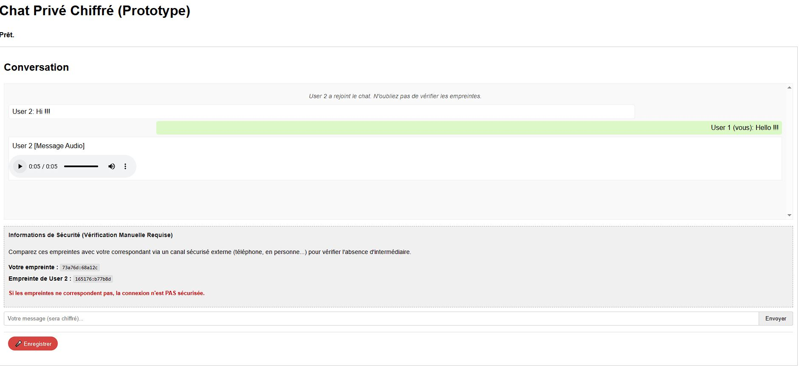

# Chat Privé E2EE (Private Chat)

[](https://github.com/artkabis/privatechat)

Un prototype de chat privé avec chiffrement de bout en bout (End-to-End Encryption), gestion des erreurs et vérification d'empreintes numériques.

## Fonctionnalités

- 🔐 **Chiffrement de bout en bout** utilisant RSA-OAEP et AES-GCM pour les messages texte et audio
- 🔊 **Messages audio** chiffrés et transmis par fragments pour une meilleure fiabilité
- 👥 **Chat en duo** (limité à 2 participants par salon)
- 🔍 **Vérification d'empreintes** pour confirmer l'absence d'attaque de l'homme du milieu
- 🔗 **Génération de liens uniques** pour chaque conversation
- ✅ **Validation explicite** des participants par l'hôte du salon
- 🔔 **Notifications sonores et visuelles** pour les nouveaux messages et participants
- 📱 **Interface responsive** compatible avec appareils mobiles
- ⚠️ **Gestion robuste des erreurs** et des cas limites

## Architecture

### Serveur (Node.js)
- Express pour le serveur HTTP et routes
- Socket.IO pour la communication en temps réel
- UUID pour la génération d'identifiants uniques de salons

### Client (JavaScript)
- Web Crypto API pour le chiffrement/déchiffrement
- MediaRecorder API pour l'enregistrement audio
- Interface utilisateur HTML/CSS adaptative

## Installation et lancement

### Prérequis
- Node.js (v14 ou supérieur)
- npm

### Installation
```bash
# Cloner le dépôt
git clone https://github.com/artkabis/privatechat.git
cd privatechat

# Installer les dépendances
npm install
```

### Lancement
```bash
# Démarrer le serveur
npm start
```

Le serveur sera accessible à l'adresse `http://localhost:3838/`

## Utilisation

1. **Générer un lien de chat** en accédant à la page d'accueil
2. **Partager le lien** avec votre correspondant
3. **Entrer votre nom** et rejoindre/démarrer le chat
4. **Accepter la connexion** de votre correspondant (si vous êtes l'initiateur)
5. **Vérifier les empreintes** par un canal externe (appel téléphonique, etc.)
6. **Échanger des messages** texte ou audio en toute sécurité

## Sécurité

### Modèle de menace
Ce prototype protège contre :
- Interception passive des communications
- Attaques de l'homme du milieu (avec vérification des empreintes)
- Compromission du serveur (le serveur ne peut pas lire les messages)

### Limites
- Le serveur peut voir qui parle à qui (métadonnées)
- Pas de perfect forward secrecy (une seule paire de clés pour toute la session)
- Prototype à des fins éducatives, non audité pour une utilisation en production

## Fonctionnement technique

### Établissement de la session
1. Génération des paires de clés RSA (2048 bits) pour chaque participant
2. Échange des clés publiques via le serveur
3. Validation manuelle des empreintes pour détecter toute attaque

### Chiffrement des messages texte
- Chiffrement RSA-OAEP direct du texte avec la clé publique du destinataire

### Chiffrement des messages audio
- Chiffrement hybride :
  - Génération d'une clé AES-GCM aléatoire pour chaque message audio
  - Chiffrement des données audio avec AES-GCM
  - Chiffrement de la clé AES avec RSA-OAEP
  - Transmission par fragments pour les gros fichiers audio

### Système de notifications
- Notifications sonores personnalisables pour:
  - Arrivée d'un nouvel utilisateur dans le salon
  - Réception d'un message texte
  - Réception d'un message audio
- Notifications visuelles:
  - Highlight sur la zone de messages lors de nouvelles communications
  - Animation du titre de la page quand celle-ci n'est pas active
  - Compteur de messages non lus dans le titre de l'onglet
- Préférences utilisateur sauvegardées dans le localStorage

## Structure du projet

```
privatechat/
├── server.js             # Serveur principal (Express + Socket.IO)
├── package.json          # Configuration du projet et dépendances
├── public/               # Fichiers clients servis par Express
│   ├── index.html        # Interface utilisateur HTML
│   ├── style.css         # Styles CSS
│   ├── client.js         # Logique client (crypto, UI, Socket.IO)
│   └── sounds/           # Fichiers audio pour les notifications
│       ├── message.mp3   # Notification pour messages texte
│       ├── user-join.mp3 # Notification quand un utilisateur rejoint
│       └── audio-message.mp3 # Notification pour messages audio
└── README.md             # Ce fichier
```

## Développement futur

- [ ] Améliorer la gestion de la connexion/reconnexion
- [ ] Ajouter le chiffrement avec perfect forward secrecy
- [ ] Support pour les conversations de groupe
- [x] Notifications sonores et visuelles
- [ ] Notifications de frappe
- [ ] Partage de fichiers chiffrés
- [ ] Mode sombre
- [ ] Tests unitaires et d'intégration

## Licence

MIT

## Avertissement

Ce projet est un prototype éducatif destiné à illustrer les concepts de chiffrement de bout en bout. Il n'est pas recommandé pour une utilisation en production sans un audit de sécurité approprié.